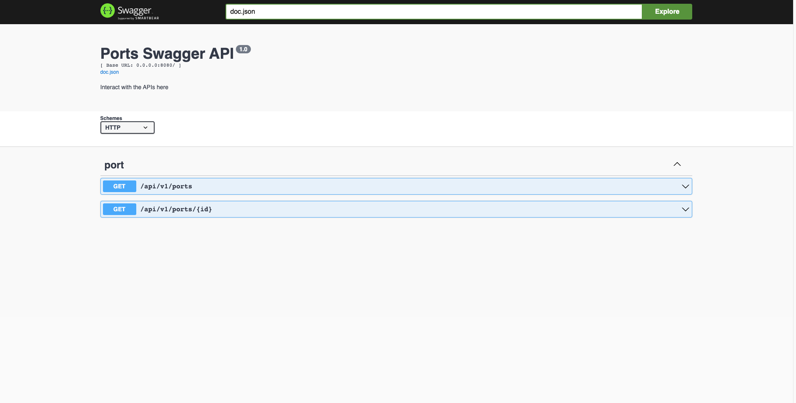

# ports

Managing ports service


## Development

You can either run the application locally or with docker.

### Running Locally:
spin off the mysql container -> `docker-compose run mysql`  
run server -> `make local-server`   
hot reloads -> `go install github.com/cespare/reflex@latest` -> `make watch`  

### Running on Docker:
just do `make run` and it'll take a while for the first time for the service to get ready.  

***
## Tests

Once your application is up and running you can run the tests with either, 

``` bash
make test
```

OR

```bash
./go-checks.sh
```

The latter will also do linter checks along with some other common tests.  

***

## Logs 

To see the logs of the running container:

``` bash
make logs
```

***
## Docs

If you want to add or modify the docs:   
- Install swag -> ‍‍‍```go install github.com/swaggo/swag/cmd/swag@latest```
then -> make docs   

### Swagger UI

http://0.0.0.0:8080/swagger/index.html


  

***

## NOTES
The `/* NOTES: TEXT */` are TBD

***
